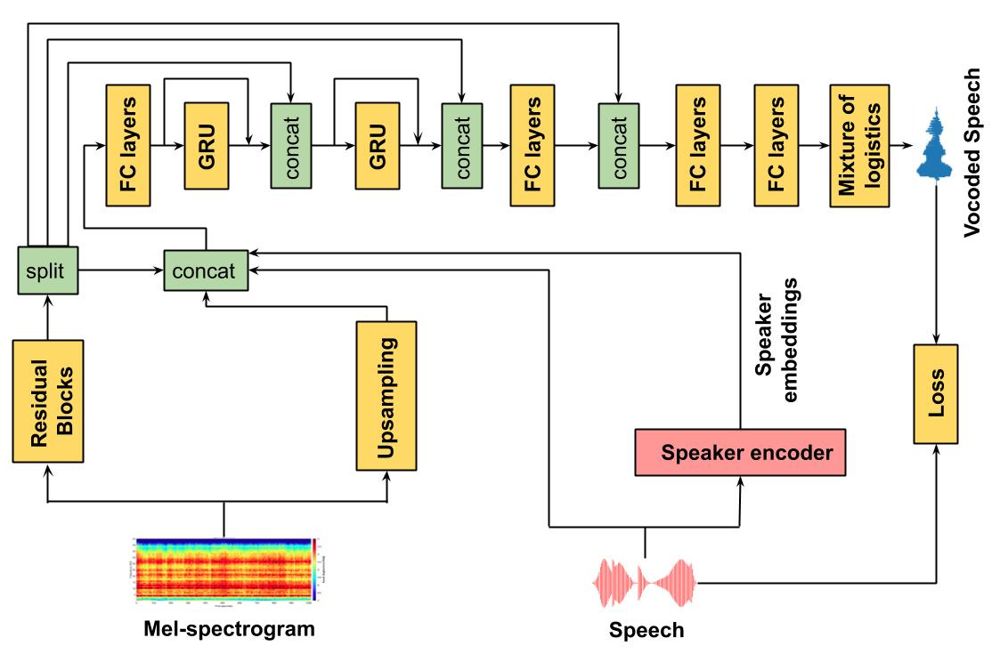

# SC-WaveRNN

Speaker Conditional WaveRNN: Towards Universal Neural Vocoder for Unseen Speaker and Recording Conditions

Dipjyoti Paula, Yannis Pantazisb and Yannis Stylianoua

aComputer Science Department, University of Crete

bInst. of Applied and Computational Mathematics, Foundation for Research and Technology - Hellas

### Abstract:

Recent advancements in deep learning led to human-level performance in single-speaker speech synthesis. However, there are still limitations in terms of speech quality when generalizing those systems into multiple-speaker models especially for unseen speakers and unseen recording qualities. For instance, conventional neural vocoders are adjusted to the training speaker and have poor generalization capabilities to unseen speakers. In this work, we propose a variant of WaveRNN, referred to as speaker conditional WaveRNN (SC-WaveRNN). We target towards the development of an efficient universal vocoder even for unseen speakers and recording conditions. In contrast to standard WaveRNN, SC-WaveRNN exploits additional information given in the form of speaker embeddings. Using publicly-available data for training, SC-WaveRNN achieves significantly better performance over baseline WaveRNN on both subjective and objective metrics. In MOS, SC-WaveRNN achieves an improvement of about 23% for seen speaker and seen recording condition and up to 95% for unseen speaker and unseen condition. Finally, we extend our work by implementing a multi-speaker text-to-speech (TTS) synthesis similar to zero-shot speaker adaptation. In terms of performance, our system has been preferred over the baseline TTS system by 60% over 15.5% and by 60.9% over 32.6%, for seen and unseen speakers, respectively.

# Audio Samples:

Audio samples can be found in [here.](https://www.csd.uoc.gr/~dipjyotipaul/Universal-vocoder-IS20)

# Tacotron + WaveRNN Diagram:

# WaveRNN Diagram:

Pytorch implementation of Tarotron and WaveRNN model.

# Installation

Ensure you have:

* Python >= 3.6
* [Pytorch 1 with CUDA](https://pytorch.org/)

Then install the rest with pip:

> pip install -r requirements.txt

### Preprocessing
Download your Dataset.
* VCTK Corpus

Edit **hparams.py**, point **wav_path** to your dataset and run:

> python preprocess.py

or use preprocess.py --path to point directly to the dataset
___

### Speaker encoder

Follow repo [speaker_embeddings_GE2E](https://github.com/dipjyoti92/speaker_embeddings_GE2E)

### Train Tacotron & WaveRNN
Here's my recommendation on what order to run things:

1 - Train Tacotron with:

> python train_tacotron.py

2 - You can leave that finish training or at any point you can use:

> python train_tacotron.py --force_gta

this will force tactron to create a GTA dataset even if it hasn't finish training.

3 - Train WaveRNN with:

> python train_wavernn.py --gta

NB: You can always just run train_wavernn.py without --gta if you're not interested in TTS

4 -  Generate Sentences with WaveRNN model:

python gen_wavernn.py --file <...> --weights <...> --output <...>

the reference speech path should be provided in --file <...> .

4 - Generate Sentences with both models using:

python gen_tacotron_spk_embed.py --file <...> --weights_path <...> --weights_voc <...> --output <...> --input_text <...>

the reference speech path should be provided in --file <...> .

And finally, you can always use --help on any of those scripts to see what options are available :)

____

### References

* [Efficient Neural Audio Synthesis](https://arxiv.org/abs/1802.08435v1)
* [Tacotron: Towards End-to-End Speech Synthesis](https://arxiv.org/abs/1703.10135)
* [Natural TTS Synthesis by Conditioning WaveNet on Mel Spectrogram Predictions](https://arxiv.org/abs/1712.05884)

### Acknowlegements

* [https://github.com/fatchord/WaveRNN](https://github.com/fatchord/WaveRNN)
* [https://github.com/keithito/tacotron](https://github.com/keithito/tacotron)
* [https://github.com/CorentinJ/Real-Time-Voice-Cloning](https://github.com/CorentinJ/Real-Time-Voice-Cloning)
